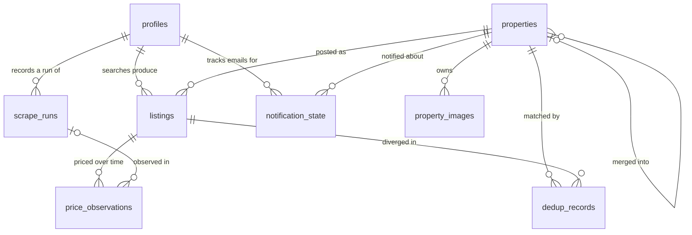

# Database schema

State lives in one embedded SQLite file, `rentczecher.db`, in the data
directory. Numbered migrations under
`src/rentczecher/adapters/repositories/sqlite/migrations/` are the live DDL;
this document explains the model behind them.

## The model in one picture
- A **property** is the *inferred* real-world unit — the actual flat or house.
  Identity is always a conclusion, never certain: even a portal's own listing id
  is only the strongest signal, because a delisted-then-relisted flat reappears
  under a new id.
- A **listing** is one portal's posting of a property — a thin pointer. The same
  flat on Sreality and Bezrealitky is one property with two listings.
- The property **owns the canonical facts** (title, location, size, disposition,
  GPS, land) and the **superset of images**. The first listing to create a
  property seeds those facts.
- When a later listing is judged the same property but its facts *differ*, the
  difference is recorded in **dedup_records**, not on the property — so the
  cross-portal disagreement ("Sreality says 55 m², Bezrealitky says 56 m²") is
  preserved and reportable, and the canonical view stays single.

## The tables and how they link

Relationships only; columns are in the table below. This mirrors the foreign
keys in `0001_init.sql` — the migration is authoritative if the two disagree.

## Tables

| Table | Holds |
|---|---|
| `profiles` | One row per configured search: `id`, `name`, `active`, `created_at`; the search *parameters* stay in `config.yaml`. |
| `properties` | The canonical real-world unit. Global (not per-profile). `merged_into` tombstones a property that dedup folded into another. |
| `listings` | One per-portal posting: `source:source_id`, which property/profile, url, seen/scraped timestamps, `miss_count`, `active`. No facts of its own. |
| `property_images` | Superset of image URLs across a property's listings. `local_path` is reserved (always null today) for an opt-in photo-archiving feature. |
| `price_observations` | Append-only price (+charges) time series, one stream per listing. Never updated. A property's price history is the union over its listings. |
| `dedup_records` | Audit trail of every dedup match: why two were judged the same (`match_reason`) and how the listing's facts diverged from canonical (`differences`, JSON). |
| `notification_state` | Per `(profile, property)`: has this profile been emailed about this property, and at what price (the price-drop baseline). |
| `scrape_runs` | One row per profile per run: timings, status, counts. Data staleness = the latest non-failed run's `started_at`. |
