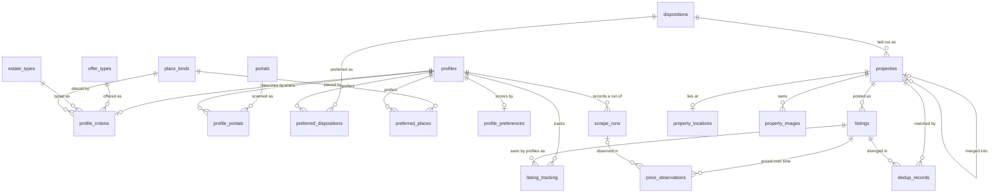

# Database schema

State lives in one embedded SQLite file, `rentczecher.db`, in the data
directory. Numbered migrations under
`src/rentczecher_engine/adapters/repositories/sqlite/migrations/` are the live DDL,
this document explains the model behind them.

## The model in one picture
- A **property** is the *inferred* real-world unit, the actual flat or house.
  Identity is always a conclusion, never certain: even a portal's own listing id
  is only the strongest signal, because a delisted-then-relisted flat reappears
  under a new id.
- A **listing** is one portal's posting of a property, a thin pointer. The same
  flat on Sreality and Bezrealitky is one property with two listings.
- The property **owns the canonical facts** (title, location text, size, disposition text,
  GPS, land) and the **superset of images**. The first listing to create a
  property seeds those facts.
- When a later listing is judged the same property but its facts *differ*, the
  difference is recorded in **dedup_records**, not on the property, so the
  cross-portal disagreement ("Sreality says 55 m², Bezrealitky says 56 m²") is
  preserved and reportable, and the canonical view stays single.

## The tables and how they link

Relationships only, columns are in the table below. This mirrors the foreign
keys in the migrations, which are authoritative if the two disagree.

## Tables

| Table | Holds |
|---|---|
| `profiles` | One row per saved search: `id`, `name`, `paused_at` (null while it scans), `created_at`. |
| `profile_criteria` | What a listing must satisfy to be shown, one row per profile: rent or sale, the type of property, the search place as a RÚIAN kind and code, the price, size and land bounds, the room range and the kitchen kind. A null bound is no bound. |
| `profile_portals` | The portals a profile scans, one row each. |
| `profile_preferences` | A profile's scoring weights and their settings, one row per profile. A setting may be null only while its weight is 0. |
| `preferred_dispositions`, `preferred_places` | A profile's preferred dispositions and places, ranked, rank 1 the most preferred. |
| `portals`, `offer_types`, `estate_types`, `place_kinds`, `dispositions` | The fixed vocabularies the other tables reference, seeded by the migrations. |
| `properties` | The canonical real-world unit. Global (not per-profile). `merged_into` tombstones a property that dedup folded into another. |
| `listings` | One per-portal posting: `source:source_id`, which property, url, scraped timestamp. A fact of the posting, shared by every profile whose search sees it. No per-profile state. |
| `listing_tracking` | Per-profile seen state for a listing: first/last seen, `miss_count`, `viewed_at`, `favourited_at`. One row per profile and listing. Pruning deletes only these rows, never the facts. |
| `property_locations` | Where a property lies: the RÚIAN code of each unit, kraj to ulice, plus the house numbers as written. One row per property, the most detailed location any of its listings gave. The codes point into the shipped gazetteer, a separate file, so no foreign key checks them. |
| `property_images` | Superset of image URLs across a property's listings. `local_path` is reserved (always null today) for an opt-in photo-archiving feature. |
| `price_observations` | Append-only price (+charges) time series, one stream per listing. Never updated. A property's price history is the union over its listings. |
| `dedup_records` | Audit trail of every dedup match: why two were judged the same (`match_reason`) and how the listing's facts diverged from canonical (`differences`, JSON). |
| `scrape_runs` | One row per profile per run: timings, status, counts. Data staleness = the latest non-failed run's `started_at`. |
